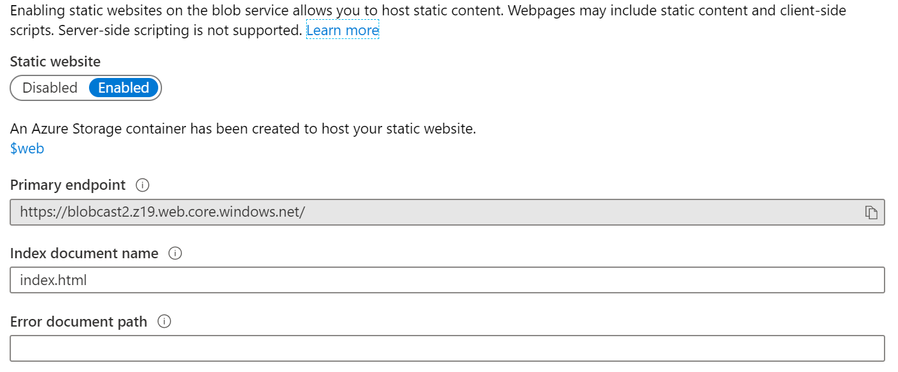
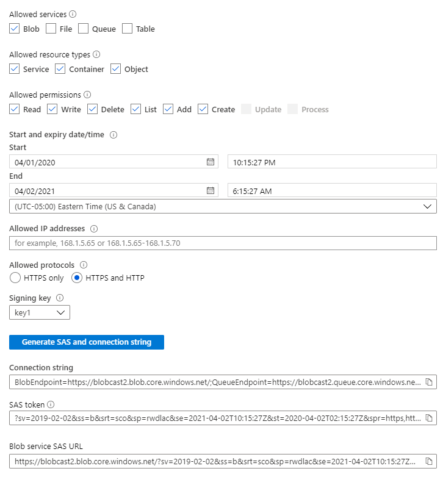
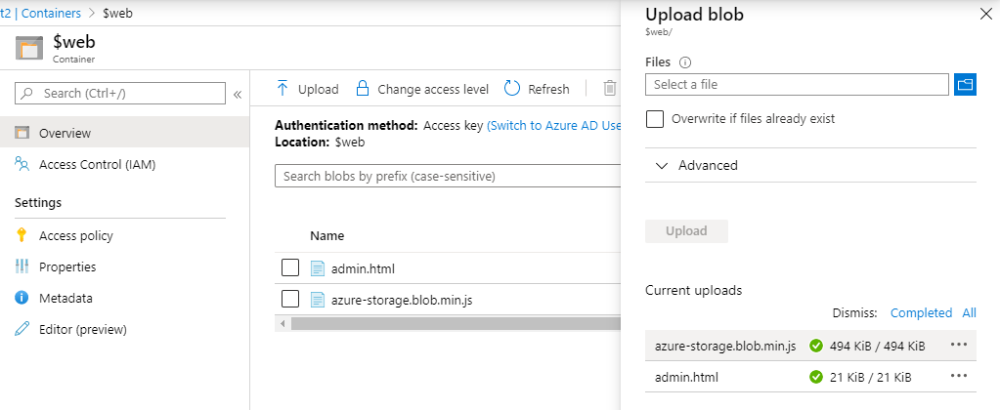
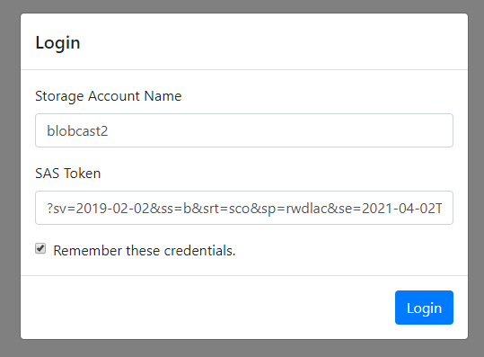

# Blobcaster: Using Azure Blob Storage to Host a Podcast

This little app grow out of a want to manage a podcast using nothing but Blob Storage. I like Blob Storage because it is versatile, fast, and incredibly inexpensive to use. I orignially thought I might use an Azure Function based API for this, but I in the process of thinking through this, I realized there was nothing about functions or any other sever side API that I needed to make this work. I could simply use a browser and interact with the Blob Storage API's. The resulting app then is both hosted on Blob Storage and interacts with Blob storage.

Rather than keep this app to myself, I thought I would share it with world shuold anyone else be interested in a similar approach. 

The one caveat to all this is that as of publishing this, there's really no good way to created an automation script to install this automatically. It could probably be done through the Azure CLI or Powershell and run in CloudShell or on a desktop, but it can also be quickly set up in the Azure Portal too. So here are the instruction on how to set this up.

## Create a Storage Account	

1. In the Azure Portal, Click "Crate a resource" and then select, Storage -> Storage account - blob, file, table, queue.

1. On the **Basics** blade -- 

	* Create a new resource group or use an existing group
	* Pick a unique name for the account
	* Select a location
	* Select a perfomance tier (Standard is probably enough)
	* Set the Account Kind to Storage V2 (General Purpose)
	* Set replication to LRS -- Local Redundany Storage
	* Set access tier to Hot

2. On **Networking**, select **Public endpoints (all networks)**.

3. On the **Advanced** blade, take the defaults. If you plan to use a custom domain, disable Secure transfer required.

4. Skip to **Review + create**, and clickc Create.

Storage Accounts usually create in less than a minute.

## Setup storage for a Static Website

1. Open the storage account resource, and select **Static website** under **Settings** on the left hand menu.

2. Enable the the **Static website**.

3. Set the **Index document name** to *index.html*.

4. Click **Save**.

5. Copy the URL from **Primary static endpoint**.

## Setup CORS

1. Select **CORS** under **Settings** on the left hand menu.

2. Paste in the copied URL from the static website into **Allowed origins**. ***REMOVE ANY TRAILING SLASHES.***

3. Select all of the methods under **Allowed methods**.

4. Set the **Allowed headers** to *.

5. Set the **Exposed headers** to *.

6. Leave **Max age** as 0,

7. Click **Save**.

8. Repeat this for the same URL, except set the protocol to HTTP instead of HTTPS for the same URL.

9. If you plan on using a custom domain, you can add that domain here as well for HTTP and/or HTTPS.

## Generate a SAS Token

The browser SDK requires a SAS Token for authentication against the storage account.

1. Click on **Shared access signature** under Settings.

2. Under **allowed services**, select *Blob*.

3. Under **Allowed resource** type, select *Service, Container, and Object*.

4. Under **Permissions**, select *Read, Write, Delete, List, and Create*.

5. Leave **Start** as is.

6. For **End**, select some arbitrary date in the future for when the token expires. I picked 1 year.

7. For **Allowed protocols**, select *HTTPS* unless you want a custom domain, then select *HTTP and HTTPS*.

8. Leave **Signing key** as is.

9. Click **Generate SAS and connection string**.

10. Copy the value under **SAS Token** and paste it in a text editor. You'll need it to connect.

## Upload Files

1. Under **Blob service**, select **Containers**.

2. Click on **$web**.

3. Click **Upload**.

4. Select *admin.html* and *azure-storage.blob.min.js* from this repository, and upload these files. At some point, you may need to upload an image for your podcast here as well. Thisis is usually a square image 1440x1440 that is used by iTunes and other Podcast services for branding purposes.

## Navigate to the website in the browser

1. In a new browser tab/window, navigate to th URL copied from Static website, then append */admin.html* This will load the login screen for the application.

2. Supply the login credentials. The **Storage Account Name** is the name of the account that you used when you created the storage account. The SAS Token is the token you created under Generate a SAS Token.

3. Check **Remeber these credentials** if you want to store the credentials in the browser. These are stored in a cookie, so this is not something you'd want to store on a public machine.

4. Click Login.

5. The UI has build in documentation. Start by editing the Podcast Metadata, which will allow you set fields releated to the podcast itself, like the Title, the Author, the Owner and other such data. When you're ready to upload an episode, click on New Episode and upload your audio file and fill out the form there. The rss.xml is automatically generated and updated when changes are made to the podcast. You can submit the rss.xml URL to podcast services like Spotify or iTunes.

## Conclusion

Blob storage as a static website does support custom domains, with the caveat that they run on HTTP. It is possible to proxy Blob Storage through a service like Akamai or Cloudflare and use SSL with a custom domain there, but that is outside the scope of this. In any case, I made remarks throughout this document about using a custom domain.

Happy Podcasting!
